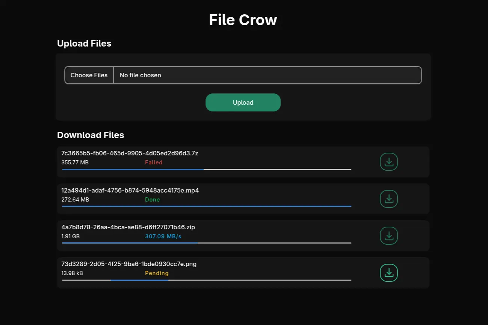

# File Crow

A file server for sharing files over a local network.



## Motivation

I often transfer files between my PC and mobile device using a USB cable. But every time I want to share something I have to take the cable out of the charger and connect both devices. So I built File Crow to share files over the local network.

## Quick Start

[Go](https://go.dev/doc/install) version 1.24.7 or higher is required.

1. Install file crow

```bash
go Install github.com/syeero7/file-crow
```

2. Start the file server

```bash
file-crow
```

3. Access the web interface at `http://localhost:8090` on the first device.

4. On other devices, access via `http://<DEVICE_IP>:8080` replacing `<DEVICE_IP>` with the device's local IP address.

5. Upload files to share from any device and download them on other devices.

## Contributing

### Clone the repo

```bash
git clone https://github.com/syeero7/file-crow
cd file-crow
```

### Build the compiled binary

```bash
go build
```

### Submit a pull request

If you'd like to contribute, please fork the repository and open a pull request to the `main` branch.
